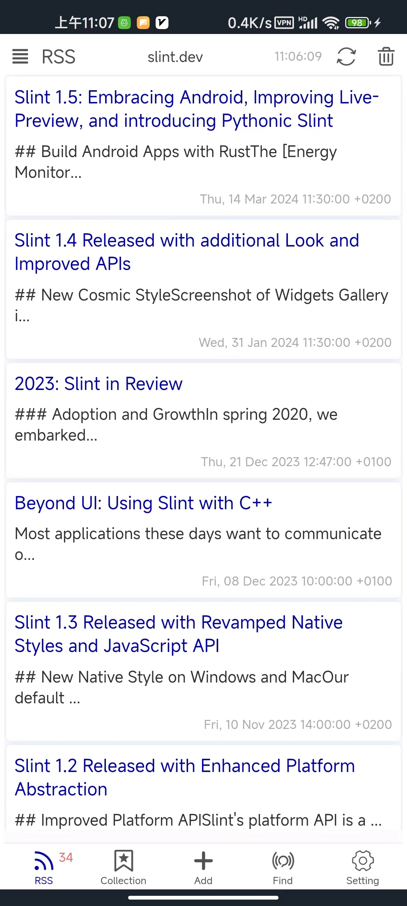
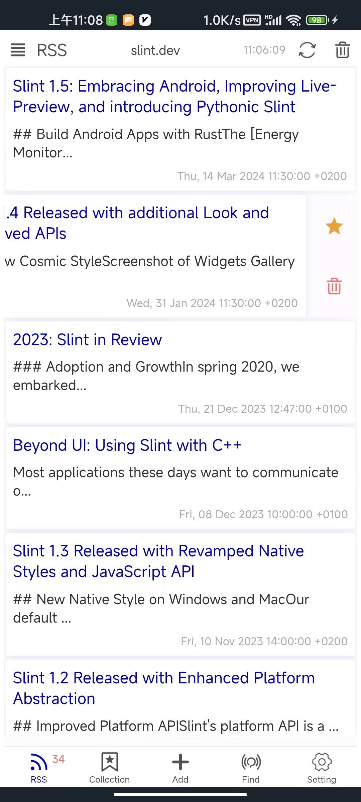

    
    
    

[中文文档](./README.zh-CN.md)

#### Introduction
It is a RSS reader. It is designed for android platform. However, you can compile it for Linux/Windows, maybe Macos(I'm not verify it), platform. It is a pure Rust project. UI based on `Slint UI`. Feel free to use it. If you encounter any problem, sending me a feedback.

#### Features
- [x] Show RSS new message.
- [x] Collect the message you like.
- [x] Add, edit and delete a RSS.
- [x] Add RSS from the [Find] page.
- [x] Setting for UI, reading, sync, proxy, clear cache and others.

##### Android platform build information
- `min-sdk-version = 23`
- `target-sdk-version = 32`

#### How to build?
- Install `Rust` and `Cargo`
- Install Android `sdk`, `ndk`, `jdk17`, and set environment variables
- Run `make` to build a release version android APK
- Run `make debug` to run it on desktop platform
- Refer to [Makefile](./Makefile) for more information

#### Reference
- [Slint Language Documentation](https://slint-ui.com/releases/1.0.0/docs/slint/)
- [github/slint-ui](https://github.com/slint-ui/slint)
- [Viewer for Slint](https://github.com/slint-ui/slint/tree/master/tools/viewer)
- [LSP (Language Server Protocol) Server for Slint](https://github.com/slint-ui/slint/tree/master/tools/lsp)
- [top-rss-list](https://github.com/weekend-project-space/top-rss-list)
- [rss-list](https://github.com/saveweb/rss-list)
- [developer.android.com](https://developer.android.com/guide)
