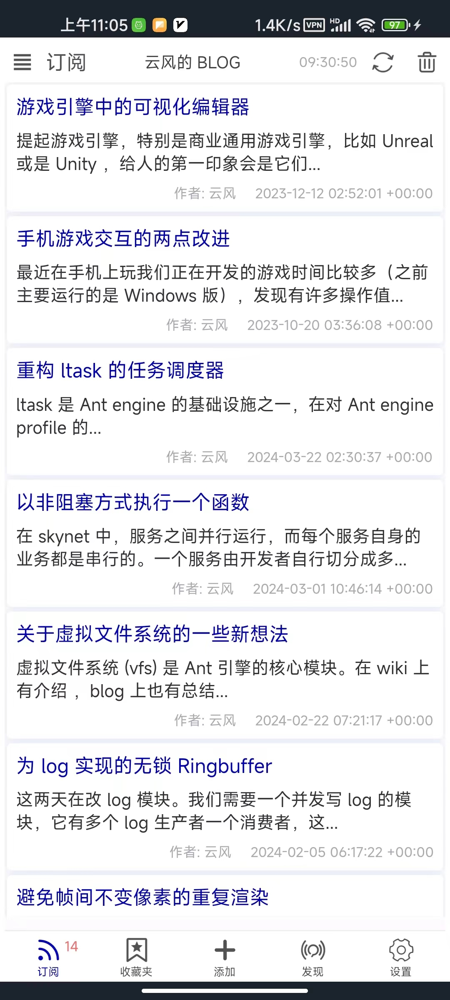
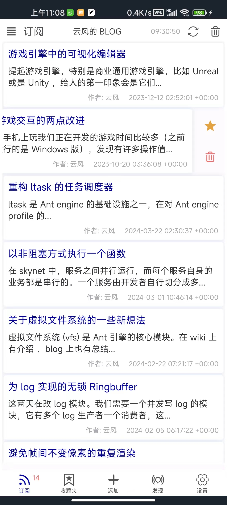
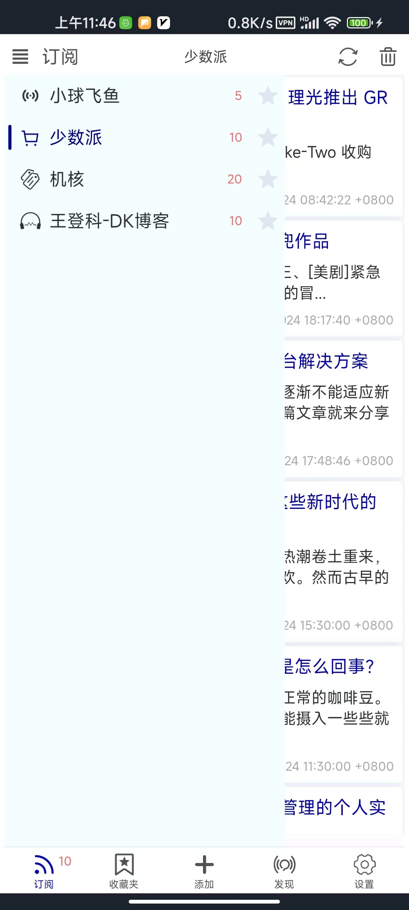

    
    
    

[English Documentation](./README.md)

#### 简介
这是一个RSS阅读客户端。专门为安卓端写的，当然你也可以编译Linux, Windows (也许Macos)平台的程序。这是一个纯Rust项目，界面基于`Slint UI`。 遇到任何问题都可以给我反馈。

#### 功能
- [x] 展示RSS信息
- [x] 收藏RSS信息
- [x] 添加，编辑和删除RSS
- [x] 可以从[发现]页面添加RSS
- [x] 可[设置]页面界面，阅读，同步，代理，清除缓存等其他设置选项

##### 安卓平台编译信息
- `min-sdk-version = 23`
- `target-sdk-version = 32`

#### 如何构建?
- 安装 `Rust` 和 `Cargo`
- 安装 Android `sdk`, `ndk`, `jdk17`, 和设置对应的环境变量
- 运行 `make` 编译安卓平台程序
- 运行 `make debug` 编译桌面平台程序
- 参考 [Makefile](./Makefile) 了解更多信息

#### 参考
- [Slint Language Documentation](https://slint-ui.com/releases/1.0.0/docs/slint/)
- [github/slint-ui](https://github.com/slint-ui/slint)
- [Viewer for Slint](https://github.com/slint-ui/slint/tree/master/tools/viewer)
- [LSP (Language Server Protocol) Server for Slint](https://github.com/slint-ui/slint/tree/master/tools/lsp)
- [top-rss-list](https://github.com/weekend-project-space/top-rss-list)
- [rss-list](https://github.com/saveweb/rss-list)
- [developer.android.com](https://developer.android.com/guide)
- [Activity 设置全屏显示的两种方式及系统自带 theme 属性解析](https://www.cnblogs.com/developer-wang/p/6771115.html)
- [More RSS](https://morerss.com/zh.php?tag=Blog)
